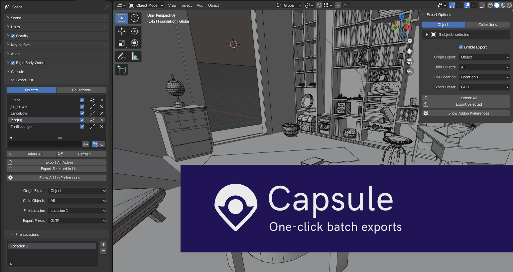

Capsule makes the process of exporting quick and seamless, letting you export hundreds of assets into multiple formats with a single click.

## Features

* **Batch Exports** - Choose export settings for hundreds of Objects and Collections with one click and export with one click.

* **Export Lists** - Browse and search through all objects and collections marked for export and quickly adjust their settings.

* **Origin Point Export** - Decide where the origin point is in your exports, no need to manually move around your objects before exporting.

* **Export Presets** - Create detailed and reusable export presets for different Export Formats, supporting Alembic, Collada, FBX, GLTF, OBJ, STL and USD/USDZ export formats.

* **Automated Folder Structures** - Automatically generate folders with certain criteria to help keep complex export setups organised.

## Installation

- Download the latest release from the releases page.
- MAKE SURE the downloaded ZIP file is renamed to "Capsule.zip"
- Under Preferences > Addons > Install, select Capsule.zip.

## FAQ
**How do I use this plugin?**

Check out the Github Wiki for quick instructions on getting started - https://github.com/Takanu/Capsule/wiki.

**What version of Blender does the plugin work with?**

The current version supports Blender 3.5, if you need support for older Blender versions then browse the Releases page and find the right one for your version - https://github.com/Takanu/Capsule/releases.

**Are there things that Capsule can't currently export?**

Theres a few use cases where Capsule may have trouble exporting assets from your scene:

* Animations that aren't attached to Armature Bones using an Object Origin Point - If you try to do this it will likely fail, keep these to using Scene origin points.

* Bone Constraints - The "Preserve Armature Constraints" button under the Armature tab in the Export Presets menu can help if you need to export an armature with bone constraints, as it is unlikely to export properly when left. This however is currently an experimental feature, so results may vary.

**What if i have a problem or bug with the add-on?**

* You can post an issue on the GitHub page (https://github.com/Takanu/Capsule/issues), this is the best place to post an issue as I can categorize and keep track of them in one place.

**Do you have any other cool add-ons?**

Yep, and they're all completely free - check out my GitHub account for other Blender goodies (https://github.com/Takanu).

